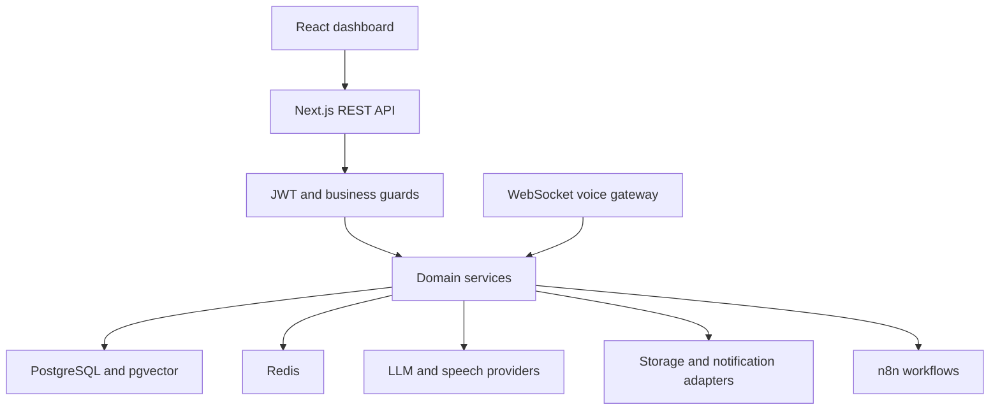

# Enterprise architecture audit — 2026-10-03

Baseline: `a50302f68e627837d4d4ca87828a0fae94a75684` (main). Prepared before implementation. Findings are from repository inspection; provider acceptance tests have not been performed.

## Current architecture

Next.js 16.2.6 App Router serves React dashboards and REST routes. Routes authenticate JWTs, enforce role thresholds and invoke Drizzle services. PostgreSQL stores business-scoped operational records and pgvector chunks. Redis provides rate limits, locks and short-lived idempotency. A separate WebSocket media process handles voice turns. OpenAI-compatible adapters provide LLM/STT/TTS/embeddings; a generic HTTP gateway provides telephony. n8n receives automation events. Local/S3 storage and SMTP/SMS/Telegram adapters already exist.

## Findings and missing capabilities

| Area | Existing evidence | Gap / priority |
|---|---|---|
| Multi-tenancy | Most tables and queries use business_id | P0: call_messages lacks direct business_id; single-column foreign keys permit inconsistent tenant references; no request context service; inactive businesses are not rejected by auth |
| Identity | bcrypt, access/refresh JWTs, lockout, logout-all | P0: rotation read/issue/revoke is not atomic; bcrypt truncates long JWT inputs; access JWTs remain valid after logout. P1: device sessions, reset, email verification, MFA, OAuth |
| RBAC | ADMIN/MANAGER/AGENT rank | P1: requested roles, explicit capability matrix, separation of platform and tenant administration |
| Agent | Bounded audited tool loop, history, tone/language config | P0: no enforced allowed-tools list. P1: model config, version history, memory/summary/intent/verification stages |
| RAG | PDF/DOCX/text parsing, chunks, embeddings, pgvector, keyword, RRF | P0: valid tool context can be ignored; failed/indexing documents remain searchable. P1: ACLs, metadata filters, versions, analytics, reranker |
| Voice | WebSocket, VAD, frame caps, turn pipeline | P1: real streaming provider verification, barge-in acceptance tests; no verified WebRTC/noise suppression/clone integration |
| Telephony | Generic gateway + provider interface | P1: Twilio/SIP/Asterisk/FreeSWITCH native integrations require real gateway contracts and test endpoints |
| CRM | Customers/leads/notes/appointments, scoring | P1: opportunities/tasks/pipeline configuration/tags/follow-up engine |
| Automation | n8n events, retry, dispatch dedup | P1: durable outbox/worker, dead-letter queue, workflow management |
| Notifications | Internal/email/SMS/Telegram adapters, status/retry | P1: templates/schedules/WhatsApp verification |
| Billing | Usage records and estimated costs | P1: subscriptions/plans/invoices/atomic quota enforcement/payment lifecycle |
| Admin | Dashboard, calls, knowledge, agents, users, usage, settings | P1: platform tenants, billing, logs, call cost/resolution analytics |
| Observability | Pino redaction, health, Sentry wiring | P1: consistent request/trace correlation, OTel export, Prometheus, Grafana |
| Security | Zod, headers, HMAC, rate limits, cookie-origin guard | P0: timestamp header is not signed in legacy webhook format; require signed timestamp mode in production and key rotation |
| Storage | Local/S3 abstraction, tenant keys | P1: quotas/lifecycle and deployment acceptance for MinIO/cloud credentials |
| Testing | Unit/integration/eval/E2E suites | P0: integrations can skip with no database; no enforced 80% coverage; no CI workflow in tree |
| DevOps | Docker prod compose, migrations, backup/restore scripts | P0: migration session lock uses pool instead of pinned connection; absent env example and CI. P1: restore drill, gated deployment |
| UX | Persian dashboards and basic workflows | P1: accessibility/RTL/dark-mode verification; agent builder and complete billing/call center |
| AI features | Lead extraction, call summary | P1: evaluated sentiment/recommendations/quality monitoring; no fabricated scores |
| Code/docs | Shared API/errors/providers, phase reports | P1: OpenAPI, DB relationship documentation, deployment/security/test evidence |

## Prioritized roadmap

1. P0 foundation: reproduce baseline tests; atomic refresh rotation; tenant lifecycle guard; request correlation; scoped cache; safe RAG context handoff and tool permissions; signed webhook timestamps; pinned migration lock; CI gates.
2. P1 identity/data: migrate direct tenant keys + same-tenant relationships with preflight; session revocation; capability RBAC; reset/verification/MFA/OAuth with real provider configuration and concurrent integration tests.
3. P1 product: agent versions/memory, document ACL/versioning, CRM tasks/opportunities, durable workflows, billing reservation/settlement and UI paths.
4. P1 operations: metrics/tracing/dashboards, complete browser E2E, 80% measured coverage, backups/restore, provider acceptance, release gates.

Keep business_id as the tenant boundary rather than introducing a competing tenant identifier. Global platform catalogs should be explicitly global; they must not receive artificial tenant keys. Roll out schema changes additively, verify/backfill historical records, then validate constraints. External providers require credentials, supported endpoints and real test accounts; unverified adapters are not production-ready.

## Release decision

Baseline is **not production-ready Enterprise SaaS**. A successful unit run does not establish tenant isolation, billing correctness or live voice operation. Track implemented work and remaining gates separately in the delivery report; do not label all twenty areas complete based on scaffolding.
